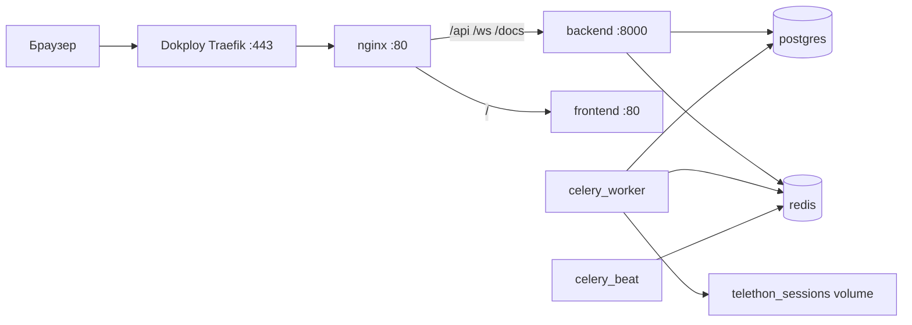

# Деплой на VPS через Dokploy

Пошаговая инструкция переноса **AI Content Platform** на VPS с сохранением данных PostgreSQL и Telethon-сессии.

## Что уже подготовлено в репозитории

| Файл | Назначение |
|------|------------|
| `docker-compose.prod.yml` | Production stack (7 сервисов) |
| `deploy/nginx/Dockerfile` | Nginx с вшитым `nginx.conf` (для Dokploy AutoDeploy) |
| `backend/docker-entrypoint.sh` | Ожидание БД + `alembic upgrade head` при старте backend |
| `.env.production.example` | Шаблон переменных для сервера |
| `scripts/prepare-migration.sh` | Экспорт БД + Telethon + копия `.env` |
| `scripts/backup-database.sh` | Только дамп PostgreSQL |
| `scripts/restore-database.sh` | Восстановление дампа на сервере |
| `scripts/export-telethon-session.sh` | Экспорт userbot-сессии |
| `scripts/import-telethon-session.sh` | Импорт userbot-сессии на VPS |

---

## Требования к VPS

- **ОС:** Ubuntu 22.04 / 24.04 (рекомендуется)
- **RAM:** минимум 4 GB (PostgreSQL + Celery worker ×4 + backend)
- **Диск:** 20+ GB SSD
- **Порты:** 80, 443 открыты (Dokploy / Traefik), 22 для SSH
- **Домен:** A-запись на IP сервера, например `panel.example.com`

---

## Часть 1. Подготовка на текущей машине (локально)

### 1.1. Убедитесь, что проект работает

```bash
docker compose ps
# Все сервисы Up, postgres healthy
```

### 1.2. Создайте пакет миграции

```bash
chmod +x scripts/*.sh
./scripts/prepare-migration.sh
```

Будет создан каталог `deploy/backups/migration-YYYYMMDD-HHMMSS/`:

- `database.sql.gz` — полный дамп PostgreSQL с данными
- `telethon-session.tar.gz` — сессия Telegram userbot (если была авторизация)
- `env.backup` — копия вашего `.env` (храните в безопасности!)

### 1.3. Закоммитьте и запушьте код

```bash
git add .
git commit -m "Add production deployment for Dokploy"
git push origin main
```

> Репозиторий должен быть доступен Dokploy (GitHub / GitLab / Gitea).

### 1.4. Скопируйте пакет миграции на VPS

```bash
scp -r deploy/backups/migration-XXXXXXXX user@YOUR_VPS_IP:/tmp/newsplatform-migration
```

---

## Часть 2. Установка Dokploy на VPS

### 2.1. Подключитесь по SSH

```bash
ssh user@YOUR_VPS_IP
```

### 2.2. Установите Dokploy

```bash
curl -sSL https://dokploy.com/install.sh | sh
```

После установки панель Dokploy доступна по `http://YOUR_VPS_IP:3000` (порт может отличаться — смотрите вывод установщика).

### 2.3. Первичная настройка Dokploy

1. Создайте администратора Dokploy
2. Подключите сервер (если спросит)
3. Настройте домен для самой панели Dokploy (опционально)

---

## Часть 3. Деплой приложения в Dokploy

### 3.1. Создайте проект

1. **Projects** → **Create Project** → имя, например `NewsPlatform`

### 3.2. Добавьте Compose-сервис

1. **Add Service** → **Compose**
2. **Provider:** Git (укажите репозиторий и ветку `main`)
3. **Compose Path:** `docker-compose.prod.yml`
4. **Build:** включите (нужна сборка backend, frontend, nginx)

### 3.3. Переменные окружения

В разделе **Environment** вставьте содержимое `.env.production.example`, заполнив секреты.

**Обязательно сгенерируйте новые значения на сервере:**

```bash
openssl rand -hex 32          # SECRET_KEY
openssl rand -base64 24       # DB_PASSWORD
```

**Важно:** `DB_PASSWORD` должен совпадать во всех строках:

- `DB_PASSWORD`
- `DATABASE_URL`
- `DATABASE_URL_SYNC`

**Хосты внутри Docker:**

| Переменная | Значение |
|------------|----------|
| `DB_HOST` | `postgres` |
| `REDIS_URL` | `redis://redis:6379/0` |
| `CORS_ORIGINS` | `https://panel.yourdomain.com` |

Скопируйте API-ключи из локального `env.backup` (`DEEPSEEK_API_KEY`, `TELEGRAM_*`, и т.д.).

Установите:

```env
DEBUG=false
ADMIN_PASSWORD=<надёжный пароль>
```

### 3.4. Первый деплой (пустая БД)

Нажмите **Deploy**. Дождитесь сборки всех образов и статуса `Running` у сервисов:

- `postgres`, `redis` — healthy
- `backend` — healthy (миграции применятся автоматически)
- `celery_worker`, `celery_beat`, `frontend`, `nginx` — running

### 3.5. Настройте домен

1. Откройте сервис Compose → **Domains**
2. **Add Domain:**
   - **Host:** `panel.yourdomain.com`
   - **Service:** `nginx`
   - **Port:** `80`
   - **HTTPS:** включить (Let's Encrypt)
3. **Redeploy** — обязательно после добавления домена!

> Не пробрасывайте порты postgres/redis наружу. В `docker-compose.prod.yml` nginx тоже без внешних портов — Traefik маршрутизирует трафик.

### 3.6. Восстановите базу данных с текущими данными

На VPS, в каталоге клонированного репозитория Dokploy (или скопируйте скрипты):

```bash
# Найдите путь к проекту Dokploy (пример)
cd /etc/dokploy/compose/<project-id>/code   # путь может отличаться

# Скопируйте .env из Dokploy UI уже должен быть на месте
export COMPOSE_FILE=docker-compose.prod.yml

chmod +x scripts/restore-database.sh
./scripts/restore-database.sh /tmp/newsplatform-migration/database.sql.gz
```

Скрипт:

1. Останавливает backend и workers
2. Пересоздаёт БД `content_platform`
3. Импортирует дамп
4. Поднимает все сервисы

**Проверка:**

```bash
docker compose -f docker-compose.prod.yml exec postgres \
  psql -U postgres -d content_platform -c "SELECT count(*) FROM sources;"
```

### 3.7. Перенос Telethon-сессии (если парсите Telegram)

```bash
./scripts/import-telethon-session.sh /tmp/newsplatform-migration/telethon-session.tar.gz
```

Если архива нет — авторизуйтесь на сервере:

```bash
docker compose -f docker-compose.prod.yml exec -it celery_worker \
  python scripts/telethon_login.py
```

Отсканируйте QR в Telegram: **Настройки → Устройства → Подключить устройство**.

---

## Часть 4. Проверка после деплоя

| Проверка | Ожидание |
|----------|----------|
| `https://panel.yourdomain.com` | Страница входа |
| Логин `ADMIN_USERNAME` / `ADMIN_PASSWORD` | Успешный вход |
| Очередь / Каналы / История | Данные из дампа на месте |
| **Jobs** → активные задачи | Celery worker отвечает |
| Публикация тестового поста | Telegram/VK/MAX работают |

Healthcheck backend:

```bash
docker compose -f docker-compose.prod.yml exec backend curl -s http://localhost:8000/health
```

---

## Архитектура production



---

## Обновление приложения

1. Пуш в `main`
2. В Dokploy: **Deploy** (или включите Auto Deploy по webhook)
3. Backend при старте автоматически выполнит `alembic upgrade head`

Перед обновлением схемы БД сделайте бэкап:

```bash
COMPOSE_FILE=docker-compose.prod.yml ./scripts/backup-database.sh
```

---

## Частые проблемы

### 502 / домен не открывается

- Убедитесь, что домен добавлен в **Domains** и выполнен **Redeploy**
- Service: `nginx`, Port: `80`
- DNS A-запись указывает на IP VPS

### `DB_PASSWORD is required`

В Dokploy Environment задайте `DB_PASSWORD` до деплоя.

### После смены `.env` ключи не подхватились

В Dokploy нажмите **Redeploy** (не просто restart контейнера).

### Celery не парсит Telegram

- Проверьте `TELEGRAM_API_ID`, `TELEGRAM_API_HASH` в Environment
- Импортируйте или создайте Telethon-сессию (шаг 3.7)
- Логи: Dokploy → `celery_worker` → Logs

### Конфликт порта 80

Dokploy Traefik уже слушает 80/443. Не добавляйте `ports: "80:80"` в compose без необходимости.

### Пустая панель после деплоя

Вы забыли шаг 3.6 — восстановление дампа. `seed_data.py` на production **не нужен**, если переносите существующую БД.

---

## Резервное копирование на сервере

Cron на VPS (ежедневно в 03:00):

```bash
0 3 * * * cd /path/to/project && COMPOSE_FILE=docker-compose.prod.yml ./scripts/backup-database.sh /var/backups/newsplatform/db-$(date +\%Y\%m\%d).sql.gz
```

Храните бэкапы вне сервера (S3, другой VPS).

---

## Минимальный чеклист

- [ ] VPS с Dokploy установлен
- [ ] DNS A-запись на домен панели
- [ ] Репозиторий подключён, `docker-compose.prod.yml` указан
- [ ] `.env` заполнен (секреты, `CORS_ORIGINS`, `DEBUG=false`)
- [ ] Первый Deploy успешен
- [ ] Домен + HTTPS в Dokploy Domains
- [ ] `restore-database.sh` выполнен
- [ ] Telethon-сессия импортирована или QR-логин
- [ ] Вход в панель и данные на месте
